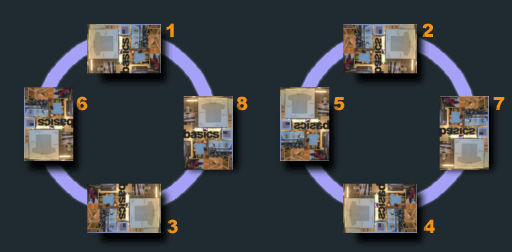

# generate-exif-fixtures
Generate a number of _JPEG_ images with different orientations.
Useful for testing software which works with _exif_ orientation.



Using `sips` and `exiftool`, create 8 fixtures from a given _JPEG_ file.

```bash
node . Author HeightWidthMax OutputDirectory Image
```

```bash
node . 'Creator <hello@me.io>' 500 outdir2 ../IMG_3555.JPG
```

## Fixtures

If you would like just to use prepared images, you can find them in `outdir` folder.
